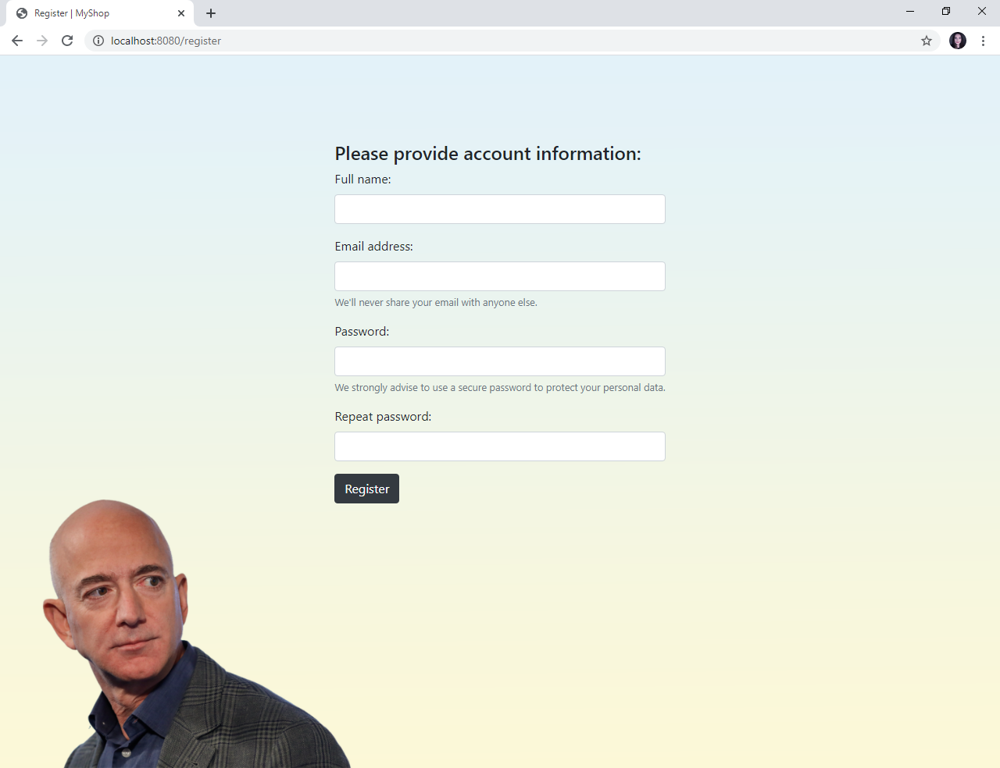

## ONLINE SHOP 

This project is deployed on **Heroku** cloud platform - [try it right now!](https://kseniia-makarova-online-shop.herokuapp.com) (first launch may take a few seconds)

---

[Project purpose](#project-purpose)

[Project structure](#project-structure)

[Implementation details](#implementation-details)

[Launch guide](#launch-guide)

[Author](#author)

---
## Project purpose

This web project represents a **simplified online** shop with basic features such as:

- Registration, login and logout
- User **password encryption**
- User **authentication and RBAC authorization**
- Product management
- Adding products to shopping cart and order completion
- Order history and management
- User management

Users with USER role are authorized to:

    - view all products
    - add to and remove products from their shopping cart
    - view shopping cart and complete order
    - view all their orders

Users with ADMIN role are authorized to:

    - add to or delete products from the list of products available for order
    - view all users and their orders
    - delete user's order or the user himself

---
## Project structure

The project uses **MVC architectural pattern**. Project structure is the following:

- Models (entity classes)
- **DAO** layer, containing basic CRUD-operations for communication with the persistence layer
- Service layer, containing business-logic of the application
- **Servlets**, implementing client-server communication logic
- **JavaServer Pages**

---
## Implementation details

- **Dependency Injection** design pattern is used in the project - DAO and Service dependencies are injected during runtime
- DAO layer has two implementations: 
    - inner-storage (List-based)
	- outer-storage (using **JDBC** connecting to **MySQL RDBMS**)
	
  To switch between the two implementations, you will need to place **@Dao annotation** before class declaration of the chosen implementation
- User authentication and RBAC authorization are realized through **filters**
- JSPs use **JSTL**, **EL** and **Twitter Bootstrap**
- Logging is implemented via **Log4j2 library**
- **Maven Checkstyle Plugin**, **Travis CI** and **SonarCloud Continuous Code Quality Tool** are configured

---
## Launch guide

To run this project you will need to install:

- [JDK 11 or higher](https://www.oracle.com/java/technologies/javase-jdk11-downloads.html)
- [Apache Maven](https://maven.apache.org/download.cgi)
- [Apache Tomcat](https://tomcat.apache.org/download-90.cgi)
- [MySQL RDBMS](https://dev.mysql.com/downloads/installer)

Here are the steps for you to follow:

- Add this project to your IDE as **Maven project**.
- If necessary, configure Java SDK 11 in Project Structure settings.
- Add new Tomcat Server configuration and select **war-exploded artifact** to deploy. Set **application context** parameter to "/".
- Change **path to your log file** in _src/main/resources/log4j2.properties_ on line 4. You may also want to change the 'filePattern' parameter on line 17.
- If you decide to use the default JDBC-based DAO implementation:
	- Execute queries listed in _src/main/resources/init_db.sql_ in MySQL RDBMS in order to **create the schema and all the tables required**.
	- Enter your **own username and password** in _src/main/java/com/internet/shop/util/ConnectionUtil.java_ class on lines 8-9.
- Run the project via Tomcat configuration.

First, you will need to register as a new user. By default, the USER role is assigned to all registered users.
 
After a successful login you will be able to inject an ADMIN user by pushing the corresponding button from the main page.

The ADMIN user will have a default email - "admin@gmail.com" and password - "1".

At this point, you may wish to login as the ADMIN user and add some products that will become available for order by USERs.

---
## Author

[Kseniia Makarova](https://github.com/KseniiaMakarova)